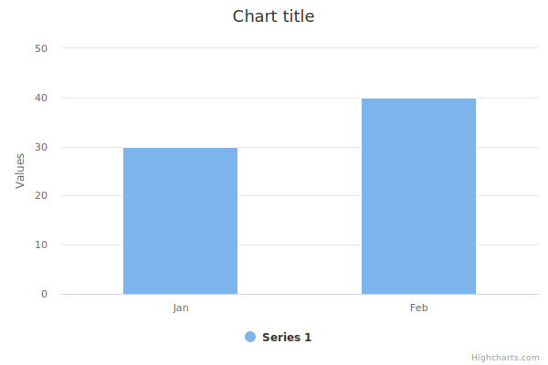

# Highcharts Export Server 
Convert Highchart ChartOptions to SVG using chromium browser.


## Installation
You need to run `npm install`, then `npm run start-server` (the app requires that port 5555 is not in use by anything else).

**The app will run in secure mode by default; which mean Highchart options MUST NOT contain any functions i.e. formatters or tick positioners ...etc, You can use `npm run start-server -- --insecure` to convert charts contain functions** 


## Usage

Send JSON POST request to *http://localhost:5555/svg*  with two properties:

1. chartOptions: chartOptions array or chartOption object **as string**
2. options: (optional) Set the height and width of the browser page where the charts will be rendered `{options : {"pageWidth": 800, "pageHeight": 450}}`

### Example
```$ curl --header "Content-Type: application/json"  --request POST --data '{ "chartOptions": "[{\"chart\":{\"type\": \"column\"},\"xAxis\":{\"categories\":[\"Jan\",\"Feb\"]},\"series\":[{\"data\":[29.9,39.9]}]}]"}' http://localhost:5555/svg```

Response: 

``` 
<svg xmlns:xlink="http://www.w3.org/1999/xlink" ... 

```
 _SVG_

